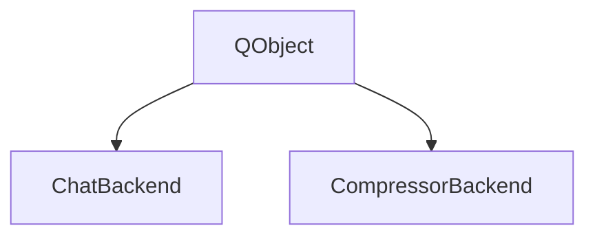

# 📦 CtxPack // 项目架构智能分析地图 (Ultimate Fusion Edition)
> 🎯 生成时间: 2026-06-17 18:06:31
> 🤖 编译环境: CtxPack Core v1.0 | DEPLOYED BY dakewick


## 📄 AIAgent_ContextCompressor\chatbackend.cpp
```
  ⚙️ REQUEST_TIMEOUT_MS = 300000
  ⚙️ CONFIG_FILE_NAME = config.json
  ⚙️ DEFAULT_MODEL_NAME = qwen2.5-coder:14b
  ⚙️ DEFAULT_OLLAMA_API_URL = http://172.16.2.67:11434/api/chat
  🤖 硬件控制: void loadConfig()
  📡 emit: emit configChanged(); // 🔔 发射信号，强制引发 QML 前端界面数据刷新
  📡 emit: emit configChanged();
  💾 数据持久化: bool saveConfig(const QString &url, const QString &model)
  📡 emit: emit configChanged(); // 🔔 同步通知前端
  🔧 功能方法: void clearHistory()
  🔗 网络通信: void sendMessage(const QString &text)
  📡 QNetworkReply::errorOccurred → ...
  📡 QNetworkReply::uploadProgress → ...
  📡 QNetworkReply::finished → ...
  📡 emit: emit messageReceived("❌ [CtxPack] 无法反序列化 AI 节点响应流: " + responseData.left(200));
  📡 emit: emit messageReceived("⚠️ [CtxPack] 目标 AI 模型返回了空白消息，可能触发了保护，请调整输入重试");
  📡 emit: emit messageReceived(replyText);
  📡 emit: emit messageReceived(friendlyMsg);
  💾 数据持久化: QJsonObject getConversationStats()
```

## 📄 AIAgent_ContextCompressor\chatbackend.h
```

### class ChatBackend : public QObject
  Q_OBJECT
    explicit ChatBackend(QObject *parent = nullptr);
    Q_INVOKABLE void sendMessage(const QString &text);
    Q_INVOKABLE void clearHistory();
    Q_INVOKABLE bool saveConfig(const QString &url, const QString &model);
    Q_INVOKABLE void loadConfig();
  signals:
    void messageReceived(const QString &text);
```

## 📄 AIAgent_ContextCompressor\code_radar.py
```
  📦 import os
  📦 import sys
  📦 import json
  📦 import re
  🔧 功能方法: def clean_line_for_braces(line)
  🔧 功能方法: def get_indent_level(line)
  🔗 网络通信: def extract_py_block(lines, start_idx)
  🔗 网络通信: def extract_cpp_block(lines, start_idx)
  💾 数据持久化: def read_file_safely(filepath)
  🔧 功能方法: def build_search_regex(target_string)
  ✅ 验证检查: def scan_project(directory, target_string)
```

## 📄 AIAgent_ContextCompressor\compressorbackend.cpp
```
  ⚙️ RADAR_TIMEOUT_MS = 10000
  ⚙️ MIN_ANIMATION_MS = 1000
  ⚙️ RADAR_SCRIPT = code_radar.py
  ⚙️ OUTPUT_FILE = project_map.md
  ⚙️ EXTRACT_SCRIPT = extract_skeleton.py
  📡 QProcess::readyReadStandardOutput → ...
  📡 emit: emit progressUpdated(output);
  📡 QProcess::readyReadStandardError → ...
  🤖 硬件控制: void singleShot(remain, this, [this, content, success]()
  📡 QProcess::errorOccurred → ...
  🤖 任务执行: void startCompression(const QString &projectPath, bool isLinuxMode)
  📡 emit: emit progressUpdated("⚠️ 当前有任务正在执行，请稍后...");
  📡 emit: emit compressionFinished(errorMsg, false);
  📡 emit: emit compressionFinished(errorMsg, false);
  📡 emit: emit currentProjectPathChanged();
  📡 emit: emit isRunningChanged();
  📡 emit: emit progressUpdated("🚀 启动解析引擎...");
  🤖 硬件控制: void singleShot(PROCESS_TIMEOUT_MS, this, [this]()
  💾 数据持久化: bool saveToFile(const QString &savePath, const QString &content)
  🔧 功能方法: QString resolvePython()
  🔧 功能方法: QVariantMap searchCodeRadar(const QString &projectDir, const QString &target)
  🤖 任务执行: void finishProcess(const QString &content, bool success)
  📡 emit: emit isRunningChanged();
  📡 emit: emit compressionFinished(content, success);
  🔧 功能方法: void cancelCompression()
```

## 📄 AIAgent_ContextCompressor\compressorbackend.h
```

### class CompressorBackend : public QObject
  Q_OBJECT
    explicit CompressorBackend(QObject *parent = nullptr);
    Q_INVOKABLE void startCompression(const QString &projectPath, bool isLinuxMode);
    Q_INVOKABLE bool saveToFile(const QString &savePath, const QString &content);
    Q_INVOKABLE void cancelCompression();
    Q_INVOKABLE QVariantMap searchCodeRadar(const QString &projectDir, const QString &target);
  signals:
    void isRunningChanged();
    void currentProjectPathChanged();
    void progressUpdated(const QString &statusText);
    void compressionFinished(const QString &resultMarkdown, bool success);
    void finishProcess(const QString &content, bool success);
```

## 📄 AIAgent_ContextCompressor\main.cpp
```
  🔧 功能方法: int main(int argc, char *argv[])
  📡 QQmlApplicationEngine::objectCreationFailed → ...
```

## 🏗️ 系统架构



## 🔄 核心业务流程


### ChatBackend

- `void loadConfig()` - 🤖 硬件控制
- `bool saveConfig(const QString &url, const QString &model)` - 💾 数据持久化
- `void sendMessage(const QString &text)` - 🔗 网络通信
- `QJsonObject getConversationStats()` - 💾 数据持久化

### QTimer

- `void singleShot(PROCESS_TIMEOUT_MS, this, [this]()` - 🤖 硬件控制

### CompressorBackend

- `void startCompression(const QString &projectPath, bool isLinuxMode)` - 🤖 任务执行
- `bool saveToFile(const QString &savePath, const QString &content)` - 💾 数据持久化
- `void finishProcess(const QString &content, bool success)` - 🤖 任务执行

### 🔬 核心底驱动/函数 (C 语言)


## 📊 数据流与关键端点


### ⚙️ 核心配置常量

- `DEFAULT_OLLAMA_API_URL` = `http://172.16.2.67:11434/api/chat`
- `DEFAULT_MODEL_NAME` = `qwen2.5-coder:14b`
- `CONFIG_FILE_NAME` = `config.json`
- `REQUEST_TIMEOUT_MS` = `300000`
- `EXTRACT_SCRIPT` = `extract_skeleton.py`
- `OUTPUT_FILE` = `project_map.md`
- `RADAR_SCRIPT` = `code_radar.py`
- `MIN_ANIMATION_MS` = `1000`
- `PROCESS_TIMEOUT_MS` = `300000`
- `RADAR_TIMEOUT_MS` = `10000`

### 🌐 网络/网络通信端点

- `http://172.16.2.67:11434/api/chat`

### 📡 关键跨类信号槽连接

- `QNetworkReply::errorOccurred`
- `QNetworkReply::uploadProgress`
- `QNetworkReply::finished`
- `QProcess::readyReadStandardOutput`
- `QProcess::readyReadStandardError`
- `QProcess::errorOccurred`
- `QQmlApplicationEngine::objectCreationFailed`

## 🎯 AI 逆向工程与开发指南

### 🔍 修改热点引导

- ⚙️ **全局常量重构**：如需调整端口、下位机 ID、超限阈值，直接搜索带有 `⚙️` 的核心配置项。

### 🚀 开发建议

- 项目依赖核心基类：`QObject`，修改子类时请注意基类虚函数实现。
- 逆向上下文中已过滤大量纯样式及布局噪点，请开发者在提示 AI 时结合 `🔄 核心业务流程` 进行精准切入。
## 📈 项目总体指标统计
- 📁 有效解析工程文件: 6 个 | 📝 估算源码有效总行数: 1,057 行
- 🔧 捕获业务函数/核心方法: 21 个 | ⚙️ 核心配置/常量项: 10 个 | 🏗️ 类定义层级: 2 个
- 📉 [Token 压缩防御矩阵] 原始全量体积: 10,958 Tokens ➔ CtxPack 压缩精炼骨架: 1,751 Tokens
- ⚡ [CtxPack 效能评级] 本次架构强力逆向压榨率: 84.0% | AI 上下文视窗安全系数极高
